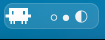

# sketchybar-clawd

A tiny [SketchyBar](https://github.com/FelixKratz/SketchyBar) widget: a **clawd**
mascot followed by **one status dot per running [Claude Code](https://claude.com/claude-code)
session** — so a glance tells you how many sessions you have and what each is doing.

<p align="center">
  
</p>

Each live session gets a dot; the dot's **shape** is its state (monochrome, no color needed).
The clawd sprite **blinks** whenever any session is working.

| Dot | State | When |
|-----|-------|------|
| `○` | **idle** | session at rest / turn finished |
| `●` | **working** | from the moment you submit a prompt until the turn ends |
| `◐` | **waiting** | session needs you — a permission prompt or a dialog |

One idle session → `clawd ○`. Four sessions → `clawd ○ ● ◐ ●`. Sessions appear on
`SessionStart` and disappear on `SessionEnd`. The mascot is the
[Claude Usage Stick](https://github.com/oauramos/claude-usage-stick) firmware's 18×5
pixel-art clawd. It works standalone too — drive a session yourself with the hook script.

## Requirements

- **macOS** with [SketchyBar](https://github.com/FelixKratz/SketchyBar) installed and running.
- **`jq`** — used to read the notification type and to merge the hooks (`brew install jq`).
  Optional if you don't use the Claude Code hooks.
- **Claude Code** — for the hooks that drive the states automatically.

The default `image` mascot ships as ready-made PNGs and needs no extra fonts. (The optional
glyph styles — `blocks` / `braille` — want a [Nerd Font](https://www.nerdfonts.com/) like
`Hack Nerd Font`; `ascii` needs nothing.)

## Install

```sh
git clone https://github.com/oauramos/sketchybar-clawd.git
cd sketchybar-clawd
./install.sh
```

The installer will:

1. Copy the widget into `~/.config/sketchybar/clawd/`.
2. Offer to add one line to your `sketchybarrc`:
   ```sh
   source "$CONFIG_DIR/clawd/clawd.widget.sh"
   ```
3. Offer to merge the Claude Code hooks into `~/.claude/settings.json`.
4. Reload SketchyBar.

It is idempotent, backs up any file before changing it, and never overwrites your config.
If your `sketchybarrc` is read-only (e.g. managed by Nix/home-manager), it prints the line
for you to add declaratively instead of editing it.

Useful flags: `--no-hooks`, `--with-hooks`, `--yes` (non-interactive), `--config-dir DIR`,
`--link` (symlink instead of copy, for development), `--print-only` (dry run).

### Manual install

```sh
cp -r src ~/.config/sketchybar/clawd
chmod +x ~/.config/sketchybar/clawd/*.sh
echo 'source "$CONFIG_DIR/clawd/clawd.widget.sh"' >> ~/.config/sketchybar/sketchybarrc
sketchybar --reload
# then, for the automatic states:
hooks/install-hooks.sh --hook ~/.config/sketchybar/clawd/clawd.hook.sh
```

## Configuration

Export any of these **before** the `source` line in your `sketchybarrc`:

| Variable | Default | Description |
|----------|---------|-------------|
| `CLAWD_STYLE` | `image` | Mascot: `image` (pixel-art sprite), or glyphs `blocks` / `braille` / `ascii` |
| `CLAWD_POSITION` | `right` | Bar side: `left`, `center`, `right` |
| `CLAWD_IMG_SCALE` | `0.4` | Sprite scale (image mode) |
| `CLAWD_IMG_WIDTH` | `34` | Mascot item width in px (image mode) |
| `CLAWD_IMG_PAD_LEFT` | `0` | Left margin before the sprite (px) |
| `CLAWD_COLOR` | `ffffff` | Sprite color `RRGGBB` — auto-recolors (needs `python3`) |
| `CLAWD_DEAD_COLOR` | `7b7d7b` | Color of the "dead"/error sprite |
| `CLAWD_SHOW_DOTS` | `1` | Show the per-session dots (`0` = mascot only) |
| `CLAWD_DOT_IDLE` / `CLAWD_DOT_WORK` / `CLAWD_DOT_WAIT` | `○` / `●` / `◐` | Per-state dot glyphs |
| `CLAWD_DOT_SEP` | `" "` | Separator between dots |
| `CLAWD_DOT_FONT` | `SF Pro:Bold:14.0` | Dots font |
| `CLAWD_DOT_COLOR` | `$CLAWD_FG` | Dots color |
| `CLAWD_SESSION_TTL` | `28800` | Prune a session with no update for this many seconds (safety net) |
| `CLAWD_FG` | `0xfff5f5f7` | Foreground/accent color |
| `CLAWD_ICON_FONT` | `Hack Nerd Font:Bold:12.0` | Mascot font (glyph styles only) |
| `CLAWD_FRAME_MS` | `150` | Blink frame interval (ms) |
| `CLAWD_BG` / `CLAWD_BORDER` / `CLAWD_BORDER_WIDTH` / `CLAWD_RADIUS` / `CLAWD_HEIGHT` | — | Box (bracket) appearance |

Example — bigger sprite on the left:

```sh
export CLAWD_POSITION=left
export CLAWD_IMG_SCALE=0.8
source "$CONFIG_DIR/clawd/clawd.widget.sh"
```

Example — match a monochrome bar (near-white clawd in a graphite box):

```sh
export CLAWD_COLOR=f5f5f7          # recolors the sprite to your foreground
export CLAWD_BG=0xbf1c1c1e         # match your box fill
export CLAWD_BORDER=0xff48484a     # and border
export CLAWD_RADIUS=9
source "$CONFIG_DIR/clawd/clawd.widget.sh"
```

`CLAWD_COLOR` renders recolored frames once (cached under `~/.cache/sketchybar-clawd/`)
using the bundled `gen-clawd.py`; the shipped default is a neutral white that suits most
bars (set `CLAWD_COLOR=D97757` for the classic Claude orange).

### The mascot sprite

The sprite is an 18×5 pixel-art clawd (rounded head, two eyes, four feet) rendered to
`frames/clawd-open.png`, `clawd-closed.png` (blink), and `clawd-dead.png`. To recolor or
resize them, regenerate with the bundled generator (pure Python 3, no dependencies):

```sh
python3 tools/gen-clawd.py --out ~/.config/sketchybar/clawd/frames --color 88c0d0 --cell-w 4 --cell-h 8
```

Prefer text? Set `CLAWD_STYLE=blocks` (or `braille` / `ascii`) for a glyph mascot instead.

## Claude Code hooks

`hooks/install-hooks.sh` merges this into `~/.claude/settings.json` (existing keys and any
other hooks are preserved; re-running never duplicates):

Each hook carries a `session_id` on stdin, so a session is tracked individually:

| Hook | Fires | This session → |
|------|-------|----------------|
| `SessionStart` | A session begins/resumes | appears as `idle` |
| `UserPromptSubmit` | You submit a prompt | `working` |
| `Stop` / `StopFailure` | Turn finishes / API error | `idle` |
| `Notification` | `permission_prompt` / `elicitation_dialog` → `waiting`; `idle_prompt` → `idle` | `waiting` / `idle` |
| `SessionEnd` | A session ends | dot removed |

`working` starts at `UserPromptSubmit` (not `PreToolUse`) so the dot reacts the instant
you hit enter, even on text-only replies. See `hooks/settings.snippet.json` for the raw block
if you'd rather paste it by hand.

Install for a single project instead of globally: `hooks/install-hooks.sh --project`.
Remove the hooks: `hooks/install-hooks.sh --remove`.

## How it works

- Each hook calls `clawd.hook.sh`, which records that session's state in
  `~/.cache/sketchybar-clawd/sessions/<session_id>` and fires the `claude_state` event.
- The `clawd` item subscribes to `claude_state`; `clawd.plugin.sh` reads every session file,
  builds the dot string (one glyph per session), and sets it on the `clawd.sessions` label.
- Whenever any session is working, the plugin runs a small background worker that blinks the
  sprite (swapping `background.image`) every `CLAWD_FRAME_MS` — a worker is used because
  SketchyBar's `update_freq` is whole-second, too coarse for a smooth blink. It's tracked by a
  PID file and stopped when no session is working, so no animation process is left running.
- If a session is killed without `SessionEnd` firing, its file is pruned after
  `CLAWD_SESSION_TTL` as a safety net.

## Uninstall

```sh
./uninstall.sh
```

Removes the widget files, the `source` line, and the hooks (backups kept). Flags:
`--keep-hooks`, `--config-dir DIR`, `--yes`.

## Troubleshooting

- **Mascot doesn't show (image mode):** make sure `frames/*.png` exist next to the scripts
  (`ls ~/.config/sketchybar/clawd/frames`) and bump `CLAWD_IMG_WIDTH` if it looks clipped.
- **Mascot shows boxes/▯ (glyph styles):** the font lacks the glyphs. Use the default
  `CLAWD_STYLE=image`, point `CLAWD_ICON_FONT` at a Nerd Font, or use `CLAWD_STYLE=ascii`.
- **No dots / nothing changes when Claude runs:** confirm the hooks are installed
  (`jq .hooks ~/.claude/settings.json`) and `clawd.hook.sh` is executable. A session that
  started *before* the hooks were installed won't appear until you relaunch `claude`. Test the
  bar side directly: `echo '{"session_id":"test"}' | ~/.config/sketchybar/clawd/clawd.hook.sh working`.
- **A dot stuck on `●`:** interrupting Claude (Esc) doesn't fire `Stop`; the next `idle_prompt`
  notification recovers it, or it's pruned after `CLAWD_SESSION_TTL`. Reset all now:
  `rm -f ~/.cache/sketchybar-clawd/sessions/* && sketchybar --trigger claude_state`.
- **A stray animation process:** `pkill -f "clawd.plugin.sh __clawd_anim__"` (a reload also
  clears it).

## License

MIT — see [LICENSE](LICENSE).
