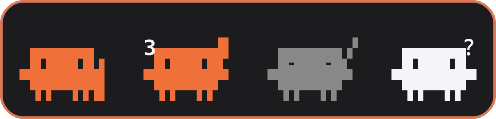
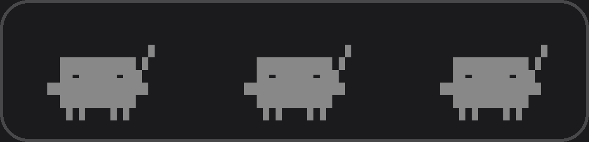
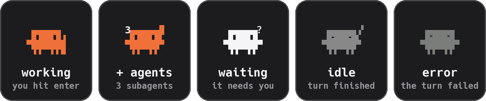

<div align="center">

# sketchybar-clawd

**A tiny pixel clawd for every Claude Code session — living in your macOS menu bar.**

Glance up. Who's working, who's stuck waiting on you, who's fast asleep.



[](https://www.apple.com/macos/)
[](https://github.com/FelixKratz/SketchyBar)
[](https://claude.com/claude-code)
[](LICENSE)

</div>

---

## The problem

You've got Claude Code running in four terminal tabs. One is waiting on a permission prompt.
One finished five minutes ago. One is off running subagents. Which is which? Right now you
find out by tabbing through every window.

## The fix

One little creature per session, always visible:



That's the whole idea. A session starts, a clawd appears. It hammers while Claude works,
wears a number when it spawns subagents, throws up a **?** when it needs you — and the box
glows orange so you catch it out of the corner of your eye.

## What each clawd is telling you



| | Means | Fires on |
|---|---|---|
| 🔨 **hammering**, orange | Claude is working | the moment you hit enter |
| 🔢 **a number over its head** | that many subagents (`/agents`) are running for it | `SubagentStart` / `SubagentStop` |
| ❓ **wide awake with a ?** | it needs you — permission prompt or dialog | `Notification` |
| 💤 **curled up asleep** | turn finished, nothing to do | `Stop` |
| 🛌 **asleep, with a number over its head** | that many sessions have slept for over an hour — they share this one clawd instead of one each | an hour with no activity |
| 💀 **X eyes, keeled over** | the turn died on an API error | `StopFailure` |

Whenever **any** session is waiting, the whole box border turns orange. That's the part you'll
actually notice while looking somewhere else.

Sessions you forgot about don't pile up either: after an hour asleep a session gives up its own
clawd and joins the hibernation clawd at the end of the line. Send it a prompt and it's back in
its old spot.

> No sessions running at all? A single clawd sits there and blinks at you — a quiet
> "nobody home, start me".

---

## Install

**You need:** macOS, [SketchyBar](https://github.com/FelixKratz/SketchyBar) already running,
[Claude Code](https://claude.com/claude-code), and `jq` (`brew install jq`).

```sh
git clone https://github.com/oauramos/sketchybar-clawd.git
cd sketchybar-clawd
./install.sh
```

The installer asks before each step, backs up anything it touches, and can be re-run safely:

1. Copies the widget to `~/.config/sketchybar/clawd/`
2. Links the `sketchybar-clawd` command into `~/.local/bin` (to change how many clawds you see
   without touching your config — see below)
3. Adds one line to your `sketchybarrc` — `source "$CONFIG_DIR/clawd/clawd.widget.sh"`
4. Merges the Claude Code hooks into `~/.claude/settings.json` (this is what makes the clawds
   move — it only *adds* to that file, your own hooks stay put)
5. Reloads SketchyBar

**Then quit and relaunch `claude`.** Hooks are read when a session starts, so tabs you already
have open won't show up until you restart them.

### Did it work?

A clawd should appear the moment you launch `claude`, and start hammering when you send a prompt.
If you'd rather not wait, fake a session:

```sh
echo '{"session_id":"test"}' | ~/.config/sketchybar/clawd/clawd.hook.sh working   # a clawd starts hammering
echo '{"session_id":"test"}' | ~/.config/sketchybar/clawd/clawd.hook.sh end       # and it's gone
```

<details>
<summary><b>Other ways to install</b> — flags, manual, read-only configs (Nix)</summary>

<br>

Installer flags: `--no-hooks`, `--with-hooks`, `--yes` (non-interactive), `--config-dir DIR`,
`--bin-dir DIR` (where the `sketchybar-clawd` command goes; default `~/.local/bin`),
`--no-command`, `--link` (symlink instead of copy — handy while hacking on it), `--print-only`
(dry run).

By hand, if you prefer:

```sh
cp -r src ~/.config/sketchybar/clawd
chmod +x ~/.config/sketchybar/clawd/*.sh
echo 'source "$CONFIG_DIR/clawd/clawd.widget.sh"' >> ~/.config/sketchybar/sketchybarrc
ln -s ~/.config/sketchybar/clawd/clawd.ctl.sh ~/.local/bin/sketchybar-clawd   # the command
sketchybar --reload
hooks/install-hooks.sh --hook ~/.config/sketchybar/clawd/clawd.hook.sh   # the automatic states
```

If your `sketchybarrc` is read-only (Nix, home-manager, a dotfiles repo), the installer won't
fight you — it prints the line to add declaratively and moves on. The command is just a symlink
to `clawd.ctl.sh`, so declare that the same way (it finds the widget through the link).

Hooks for one project only: `hooks/install-hooks.sh --project`.
Prefer to paste them yourself? See [`hooks/settings.snippet.json`](hooks/settings.snippet.json).

</details>

---

## Make it yours

Put these **above** the `source` line in your `sketchybarrc`. Nothing here is required — the
defaults are a neutral white clawd that suits most bars.

**Match your bar's colors** (the setup in the pictures above):

```sh
export CLAWD_COLOR_WORK=ef7139     # orange while working
export CLAWD_COLOR_IDLE=888888     # gray while asleep
export CLAWD_COLOR_WAIT=f5f5f7     # white when it needs you
export CLAWD_BG=0xbf1c1c1e         # box fill  — match your other boxes
export CLAWD_BORDER=0xff48484a     # box border
source "$CONFIG_DIR/clawd/clawd.widget.sh"
```

**Bigger, and on the left:**

```sh
export CLAWD_POSITION=left
export CLAWD_IMG_SCALE=0.8
export CLAWD_IMG_WIDTH=60
source "$CONFIG_DIR/clawd/clawd.widget.sh"
```

**One mascot instead of a herd** — a single clawd showing your most urgent session, plus a row
of dots (`○` idle, `●` working, `◐` waiting, `✗` error):

```sh
export CLAWD_MODE=hero
source "$CONFIG_DIR/clawd/clawd.widget.sh"
```

Recoloring is automatic: each color is rendered once by the bundled generator (needs `python3`)
and cached in `~/.cache/sketchybar-clawd/`. Set `CLAWD_COLOR=D97757` for classic Claude orange.

**How many clawds before `+K`** — six by default (`CLAWD_HERD_MAX`). Change it from the
terminal, any time, no config edit:

```sh
sketchybar-clawd 12       # show up to 12 clawds, fold the rest into +K
sketchybar-clawd          # what's showing right now, and how many are folded
sketchybar-clawd reset    # back to your sketchybarrc's value
```

It applies instantly and survives reloads. The widget pre-builds `CLAWD_HERD_POOL` slots (24),
so any number up to that is a redraw; ask for more and the command reloads SketchyBar once to
grow the pool. In hero mode the same command sets the length of the dot strip. Hibernating
sessions never count toward it — they share one clawd outside the cap.

<details>
<summary><b>Every setting</b> — the full table</summary>

<br>

| Variable | Default | What it does |
|----------|---------|--------------|
| `CLAWD_MODE` | `herd` | `herd` (one clawd per session) or `hero` (one mascot + a dot strip) |
| `CLAWD_HERD_MAX` | `6` | Clawds shown before collapsing to `+K` — `sketchybar-clawd N` overrides it at runtime |
| `CLAWD_HERD_POOL` | `24` | Slot items built at load; the highest `sketchybar-clawd N` that applies without a reload |
| `CLAWD_HERD_MS` | `180` | Herd animation frame interval (ms) |
| `CLAWD_STYLE` | `image` | `image` (pixel sprite), or the glyph styles `blocks` / `braille` / `ascii` (these force `hero`) |
| `CLAWD_POSITION` | `right` | `left`, `center`, `right` |
| `CLAWD_IMG_SCALE` | `0.4` | Sprite scale |
| `CLAWD_IMG_WIDTH` | `34` | Per-clawd item width (px) |
| `CLAWD_IMG_PAD_LEFT` | `0` | Left margin before the sprite (px) |
| `CLAWD_COLOR` | `ffffff` | Base sprite color `RRGGBB` |
| `CLAWD_COLOR_WORK` / `_IDLE` / `_WAIT` | `$CLAWD_COLOR` | Per-state sprite colors |
| `CLAWD_DEAD_COLOR` | `7b7d7b` | The keeled-over sprite |
| `CLAWD_FRAME_MS` | `150` | Hammer swing speed (ms) |
| `CLAWD_BLINK_MS` | `200` | Blink speed when no sessions are running |
| `CLAWD_SHOW_AGENTS` | `1` | Badge the running-subagent count (`0` = never) |
| `CLAWD_AGENT_COLOR` / `_FONT` / `_YOFF` | same as the `?` badge | Agent-count badge look; raise `_YOFF` (try `7`) if the number sits *on* the head instead of above it |
| `CLAWD_AGENT_MAX` | `9` | Counts above this read `9+` |
| `CLAWD_AGENT_TTL` | `3600` | Forget an agent whose `SubagentStop` never arrived, after N seconds |
| `CLAWD_HIBERNATE_AFTER` | `3600` | Seconds a session sleeps before it folds into the shared hibernation clawd, which wears their count like the agent badge (`0` = never). While on, the bar also redraws once a minute |
| `CLAWD_ASK_GLYPH` / `_COLOR` / `_FONT` / `_YOFF` | `?` / `$CLAWD_FG` / `Hack Nerd Font:Bold:9.0` / `5` | The "needs you" badge |
| `CLAWD_SHOW_DOTS` | `1` | Hero mode: show the dot strip |
| `CLAWD_DOT_IDLE` / `_WORK` / `_WAIT` / `_ERR` | `○` `●` `◐` `✗` | Dot glyphs |
| `CLAWD_DOT_HIBERNATE` | `z` | Hero mode: hibernating sessions fold into one strip entry, `z3` |
| `CLAWD_DOT_SEP` / `_FONT` / `_COLOR` | `" "` / `Hack Nerd Font:Bold:14.0` / `$CLAWD_FG` | Dot strip styling |
| `CLAWD_STRIP_MAX` | `8` | Dots shown before collapsing to `+K` — `sketchybar-clawd N` overrides it too |
| `CLAWD_SESSION_TTL` | `28800` | Drop a session with no update for N seconds — only when it has no owner pid to check; a session whose CLI is still running stays however long it idles |
| `CLAWD_PID_CHECK` | `1` | Drop a session the moment the Claude Code process that owns it is gone; `0` waits out the TTL instead |
| `CLAWD_BG` / `CLAWD_BORDER` / `CLAWD_BORDER_WIDTH` / `CLAWD_RADIUS` / `CLAWD_HEIGHT` | — | Box appearance |
| `CLAWD_BORDER_WAIT` | `0xffd97757` | Box border while a session is waiting |
| `CLAWD_FG` | `0xfff5f5f7` | Foreground/accent color |
| `CLAWD_ICON_FONT` | `Hack Nerd Font:Bold:12.0` | Mascot font (glyph styles only) |

</details>

<details>
<summary><b>The sprite</b> — poses, and how to redraw it</summary>

<br>

An 18×6 pixel clawd — rounded head, two eyes, four feet, plus a one-row band on top for props
(the mallet, the `zzz`). One PNG per pose: `clawd-open` / `clawd-closed` (blink), `clawd-dead`
(X eyes), `clawd-hammer-up` / `clawd-hammer-down` (working), `clawd-wait` (the widget adds the
`?`), `clawd-sleep` (`-_-` plus a rising `zzz`).

Regenerate them at any color or size (pure Python 3, no dependencies):

```sh
python3 tools/gen-clawd.py --out ~/.config/sketchybar/clawd/frames --color 88c0d0 --cell-w 4 --cell-h 8
# or a single pose: --pose hammer-up
```

The pictures in this README come from the same art — `tools/gen-readme-assets.py` (needs Pillow)
rebuilds them, so the docs can't drift from the mascot.

The clawd itself is borrowed from
[claude-usage-stick](https://github.com/oauramos/claude-usage-stick), a little hardware dongle
that shows your live Claude usage on a screen. Same creature, different home.

</details>

---

## How it works

Claude Code fires a **hook** on everything interesting that happens in a session. Each one hands
us a `session_id`, which is how one session becomes one clawd.

| Hook | When | That session becomes |
|------|------|----------------------|
| `SessionStart` | a session begins or resumes | idle |
| `UserPromptSubmit` | you hit enter | working |
| `Stop` | the turn ends | idle |
| `StopFailure` | the turn ends in an API error | error |
| `Notification` | permission prompt / dialog | waiting |
| `SubagentStart` / `SubagentStop` | a subagent starts / finishes | agent count ±1 |
| `SessionEnd` | the session ends | gone |

<details>
<summary><b>The details</b> — state files, animation, and one small lie Claude Code tells</summary>

<br>

- `clawd.hook.sh` writes each session's state to `~/.cache/sketchybar-clawd/sessions/<session_id>`
  and fires SketchyBar's `claude_state` event. That's the entire bridge — no daemon, and the
  only timer is a once-a-minute redraw for hibernation (below).
- Subagents get one empty file each at `~/.cache/sketchybar-clawd/agents/<session_id>/<agent_id>`,
  so the file count *is* the badge. Both subagent hooks carry the **parent** session id, so agents
  land on the clawd that spawned them.
- Every state write also stamps `~/.cache/sketchybar-clawd/owners/<session_id>` with the pid of the
  Claude Code process the hook is running under, plus that process's start time — the start time is
  what stops a recycled pid from reviving a ghost. The pid comes from `CLAUDE_PID`, else from Claude
  Code's own registry at `~/.claude/sessions/<pid>.json` (which names the session each CLI serves),
  else from walking up the hook's process ancestry.
- **The small lie:** Claude Code fires `Stop` *before* its subagents finish, so a session can claim
  it's idle with three agents still running. A session with live agents therefore keeps its working
  pose — the badge and the animation agree.
- On the event, `clawd.plugin.sh` reads every session file and draws either the herd (one slot item
  per session, sorted by start time, capped then `+K`) or the hero (most urgent session + the dot
  strip). Either way it paints the box border orange if anyone is waiting, and hangs the two badges
  on each clawd: the agent count top-left, the `?` top-right.
- **Hibernation** runs off each session file's mtime: every state change rewrites it, so it marks
  the last time the session did anything. Two things are careful not to fake that — the "still
  idle" nudge Claude Code sends a minute into a nap leaves an idle file alone, and a subagent
  finishing touches it (since `Stop` fired before the agents were done). An idle session older
  than `CLAWD_HIBERNATE_AFTER` leaves the line for the `clawd.hibernate` item. Merely staying
  asleep fires no hook, so with hibernation on the driver item gets `update_freq=60` to notice.
- `sketchybar-clawd N` is `clawd.ctl.sh`: it writes `N` to `~/.cache/sketchybar-clawd/cap` and fires
  the event. Both the widget and the plugin read that file over `CLAWD_HERD_MAX`, so it outlives a
  reload. Bar items can only be added from the rc, which is why the widget builds a pool of
  `CLAWD_HERD_POOL` hidden slots up front — the plugin fills as many as the cap allows.
- Animation comes from a small background worker swapping `background.image` between frames —
  SketchyBar's `update_freq` only goes down to one second, far too coarse for a hammer swing.
  Workers are tracked by PID file and stopped when nothing is moving.
- Nothing leaks: a session whose CLI died without firing `SessionEnd` (window closed, `SIGKILL`,
  crash) disappears on the next redraw, because its owner pid is gone. `CLAWD_SESSION_TTL` stays as
  the backstop for sessions with no owner stamp; an agent whose `SubagentStop` never arrived is
  dropped after `CLAWD_AGENT_TTL`.

</details>

---

## Something's wrong

<details>
<summary><b>Nothing happens when Claude runs</b></summary>

<br>

Check the hooks landed: `jq .hooks ~/.claude/settings.json` should mention `clawd.hook.sh`.
Then make sure you **relaunched `claude`** — sessions read hooks at startup, so tabs opened
before the install stay invisible. Test the bar on its own with:

```sh
echo '{"session_id":"test"}' | ~/.config/sketchybar/clawd/clawd.hook.sh working
```

</details>

<details>
<summary><b>No number appears when I run /agents</b></summary>

<br>

The badge needs your Claude Code to emit the `SubagentStart` hook. Check with
`jq '.hooks.SubagentStart' ~/.claude/settings.json` — if it's missing, re-run
`hooks/install-hooks.sh` and relaunch `claude`. On an older Claude Code that never sends that
hook, everything else still works; you just don't get the number.

If the number sits *on* the head rather than above it, raise `CLAWD_AGENT_YOFF` (`7` is right for
`CLAWD_IMG_SCALE=0.3`). Too high and the box clips it.

</details>

<details>
<summary><b>No clawd at all / it looks clipped</b></summary>

<br>

Confirm the frames are there: `ls ~/.config/sketchybar/clawd/frames`. If the sprite looks cut off,
raise `CLAWD_IMG_WIDTH`. Seeing ▯ boxes instead? That's a glyph style without the right font —
stick to the default `CLAWD_STYLE=image`, or point `CLAWD_ICON_FONT` at a
[Nerd Font](https://www.nerdfonts.com/).

</details>

<details>
<summary><b><code>sketchybar-clawd: command not found</code></b></summary>

<br>

The installer links it into `~/.local/bin` — make sure that's on your `PATH`, or re-run with
`--bin-dir` pointing somewhere that is. Until then it also works by its full path:
`~/.config/sketchybar/clawd/clawd.ctl.sh 12`.

</details>

<details>
<summary><b>A clawd is stuck working forever</b></summary>

<br>

Interrupting Claude with Esc doesn't fire `Stop`. The next notification recovers it, it goes away
with the session that owns it, or — when no owner pid was recorded — it ages out after
`CLAWD_SESSION_TTL`. To reset everything right now:

```sh
rm -f ~/.cache/sketchybar-clawd/sessions/* ~/.cache/sketchybar-clawd/owners/* \
  && sketchybar --trigger claude_state
```

Stray animation process? `pkill -f "clawd.plugin.sh __clawd_"` (a reload clears them too).

</details>

---

## Uninstall

```sh
./uninstall.sh
```

Removes the widget, the `sketchybar-clawd` command link, the `source` line and the hooks —
keeping a backup of each. Flags: `--keep-hooks`, `--config-dir DIR`, `--bin-dir DIR`, `--yes`.

## License

MIT — see [LICENSE](LICENSE).

<div align="center">
<br>
<sub>Built for people who keep too many Claude Code tabs open.</sub>
</div>
